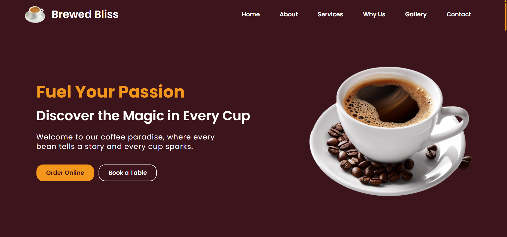
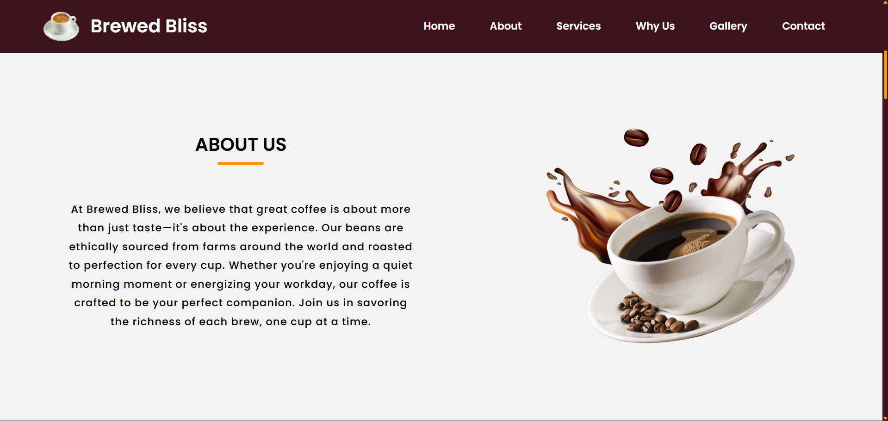
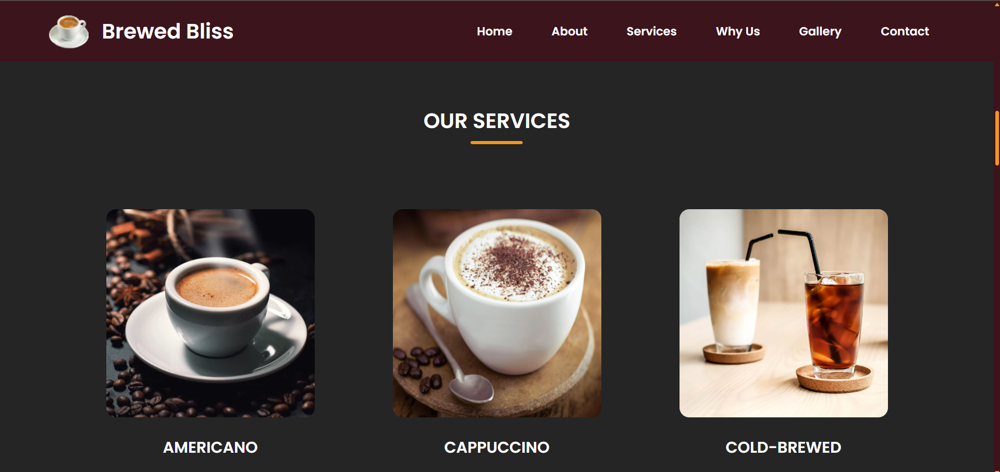
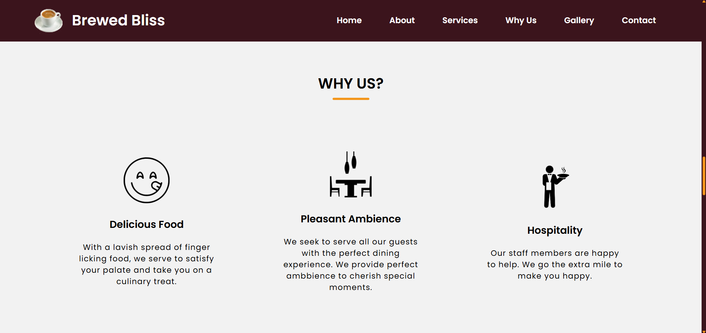
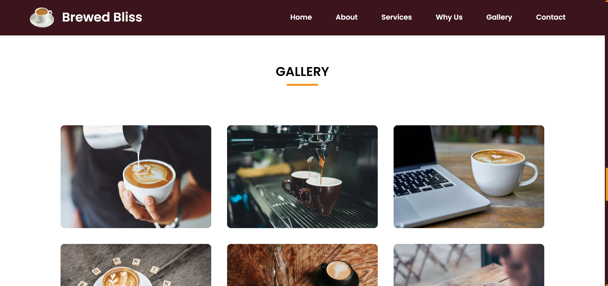
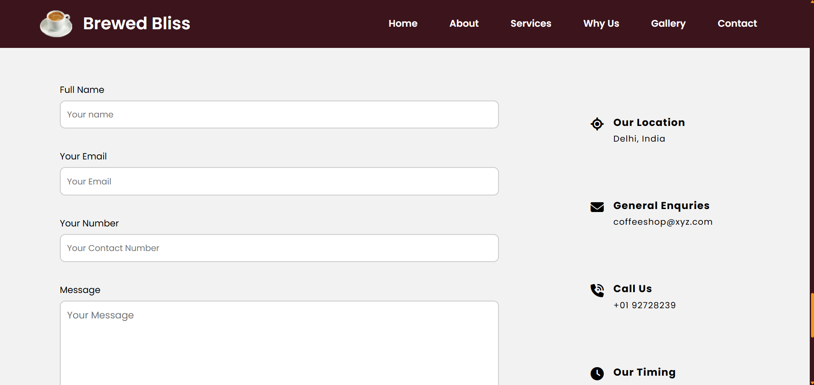

# ☕ Brewed Bliss - Coffee Website

Welcome to **Brewed Bliss**, your digital coffeehouse experience! <br/>
This project brings the cozy warmth, aroma, and atmosphere of a café straight to your screen. Explore the menu, browse the gallery, learn our story, and get in touch—all through a beautifully crafted, fully responsive website.

---

## 📸 Screenshots

| 🏠 Home Section | 👥 About Us Section |
|------------|------------|
|  |  |

| 🛠️ Services Section | ⭐ Why Us Section |
|------------|------------|
|  |  |

| 🖼️ Gallery Section | 📞 Contact Us Section |
|------------|------------|
|  |  |

---

## 🌐 Live Demo

The project is live and can be viewed here: [Brewed Bliss Coffee Website](https://tonystark-19.github.io/Coffee-Website/)

---

## 📌 Features

- 🎨 Fully Responsive UI – Seamlessly adapts to mobile, tablet, and desktop layouts
- 📖 About Section – Learn more about our café’s story and philosophy
- ☕ Menu Display – Showcasing a variety of delightful coffee and beverages
- 🌟 Why Choose Us Section – Highlights ambiance, food quality, and hospitality
- 🖼️ Gallery Section – Aesthetic visuals reflecting the café's vibe
- 📞 Contact Form – Easy and functional for reservations and inquiries
-💬 Font Awesome Icons – Clean icons for enhanced user experience

---

## 🛠️ Built With

- **HTML5**
- **CSS3**
- **JavaScript (Vanilla)**
- **Font Awesome** (for icons)

---

## 🚀 Getting Started

To run the project locally:

1. Clone the repository:

   ```bash
   git clone https://github.com/TonyStark-19/Coffee-Website.git
   ```

2. Navigate into the project folder:

   ```bash
   cd Coffee-Website
   ```

3. Open `index.html` in your browser.

---

## 💙 Author

Made with ❤️ by **Aditya Chandel** <br />
If you liked this project, feel free to ⭐ the repo!
