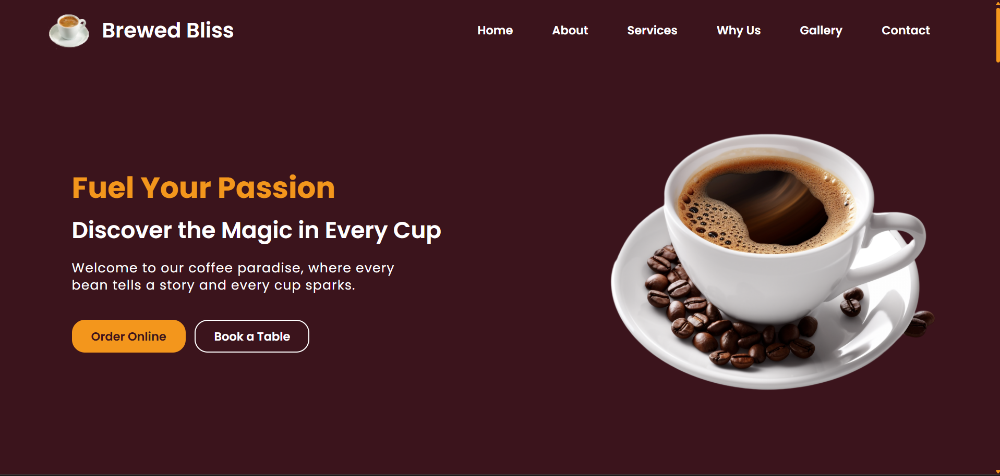

# Brewed Bliss - Coffee Website

Welcome to **Brewed Bliss**, a website that brings the warmth of a coffeehouse to the digital world. This fully responsive website showcases our menu, services, and ambiance, allowing users to explore our coffee offerings, view our gallery, and easily contact us for orders, reservations, or general inquiries.

---

## 📸 Screenshots

### Homepage :

---

## 🌐 Live Demo

The project is live and can be viewed here: [Brewed Bliss Coffee Website](https://tonystark-19.github.io/Coffee-Website/)

---

## 📖 Project Description

The **Brewed Bliss Coffee Website** is a modern, user-friendly, and fully responsive website built with **HTML, CSS, and JavaScript**. It provides an engaging online presence for our coffeehouse with aesthetically pleasing sections designed to enhance user experience and highlight our cafe’s unique features.

---

## ✨ Key Features

- **Fully Responsive Design** – Optimized for desktops, tablets, and mobile devices.
- **Responsive Navbar** – Seamlessly navigate through different sections.
- **Home Section** – A warm welcome banner with a call-to-action for online orders or table bookings.
- **About Section** – Discover our cafe’s story and philosophy.
- **Services Section** – Showcasing various coffee options with descriptions and images.
- **Why Us Section** – Highlights our exceptional offerings such as delicious food, great ambiance, and warm hospitality.
- **Gallery Section** – A visual tour of our cafe’s environment and menu items.
- **Contact Section** – Users can fill out a contact form or find other ways to reach us (not functionable yet)
- **Footer Section** – Includes quick links, contact details, and social media connections.
- **JavaScript Menu Toggle** – A smooth and interactive menu toggle functionality for mobile navigation.

---

## 💻 Technologies Used

- **HTML5**
- **CSS3**
- **JavaScript** (for menu toggle functionality)
- **FontAwesome Icons** (for enhanced UI elements)

---
